<h1>Entra Connect Hybrid Identity Lab</h1>

<h2>Description</h2>
This project connects the on-prem Active Directory domain from my [Active Directory Home Lab](https://github.com/kkeith5/ActiveDirectoryHomeLab) to Microsoft Entra ID using Microsoft Entra Connect Sync, creating a hybrid identity environment. On-prem users and groups now sync into Entra ID alongside the cloud-only users from my [Microsoft 365 / Entra ID Admin Lab](https://github.com/kkeith5/Microsoft365EntraIdAdminLab), and both sets of users are picked up correctly by the same dynamic security groups.
 

<h2>Why I built this</h2>
I built this as I saw it as a logical next step to combine Active Directory lab and the Entra Id lab and would be perfect to simulate a real corporate environement. From looking at job adverts it is common for real companies to implement a hybrid identiy environment and this will prove a good home environemnt to continue to develop.

<h2>Skills Demonstrated</h2>

- Installing and configuring Microsoft Entra Connect Sync (Custom installation)
- Password Hash Synchronization and Seamless SSO
- Scoped OU filtering to control what syncs to the cloud
- Least-privilege sync account configuration (dedicated service account instead of Domain Admin)
- Troubleshooting UPN suffix and attribute-format mismatches between on-prem AD and Entra ID
- Understanding one-way vs two-way sync behaviour (AD → Entra ID, and password writeback)

<h2>Utilities Used</h2>

- <b>Microsoft Entra Connect Sync</b>
- <b>Active Directory Users and Computers</b>
- <b>Microsoft Entra admin center</b>
- <b>PowerShell</b>

<h2>Environments Used</h2>

- <b>Windows Server</b> (VERSION) — on-prem Domain Controller
- <b>Microsoft Entra ID</b> tenant (Microsoft 365 E5 / Entra ID P2 trial)

<h2>Lab walk-through:</h2>

<h3>1. Custom installation selected:</h3>
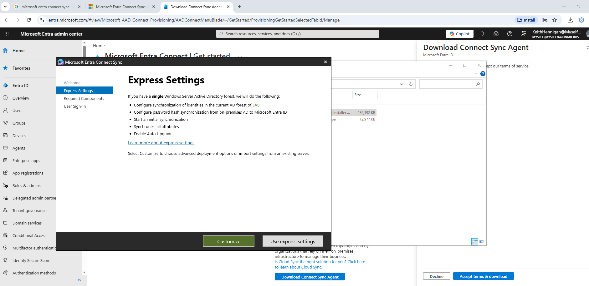
  

<h3>2. Required components installed:</h3>
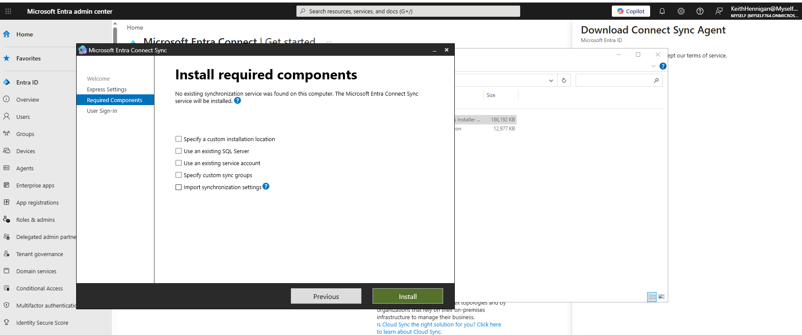
  

<h3>3. User sign-in method — Password Hash Synchronization:</h3>
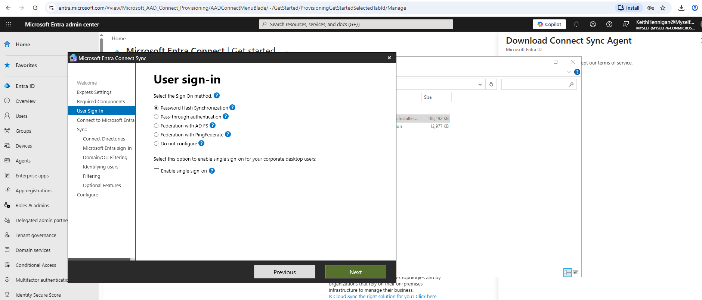
  

<h3>4. Connect to Microsoft Entra ID:</h3>
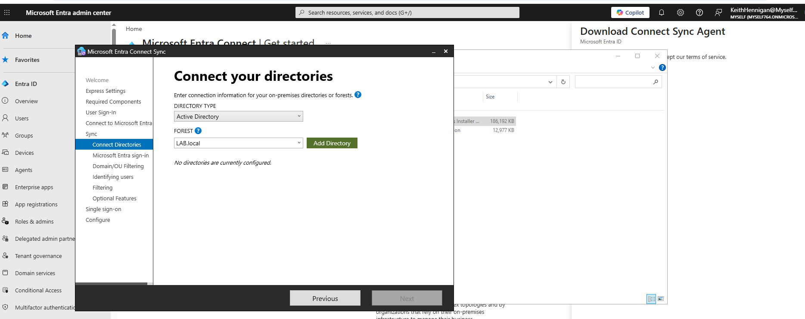
  

<h3>5. Connect your on-prem AD forest:</h3>
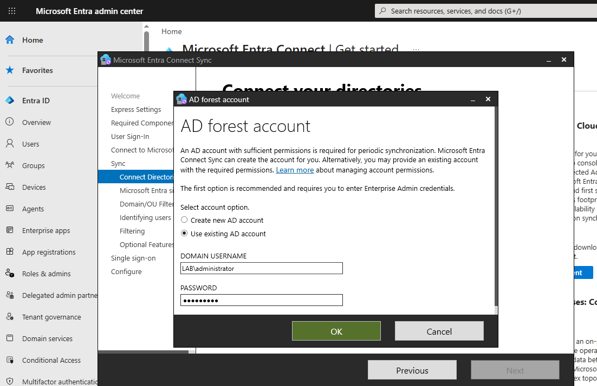
  

<h3>6. Microsoft Entra sign-in configuration — UPN suffix check:</h3>
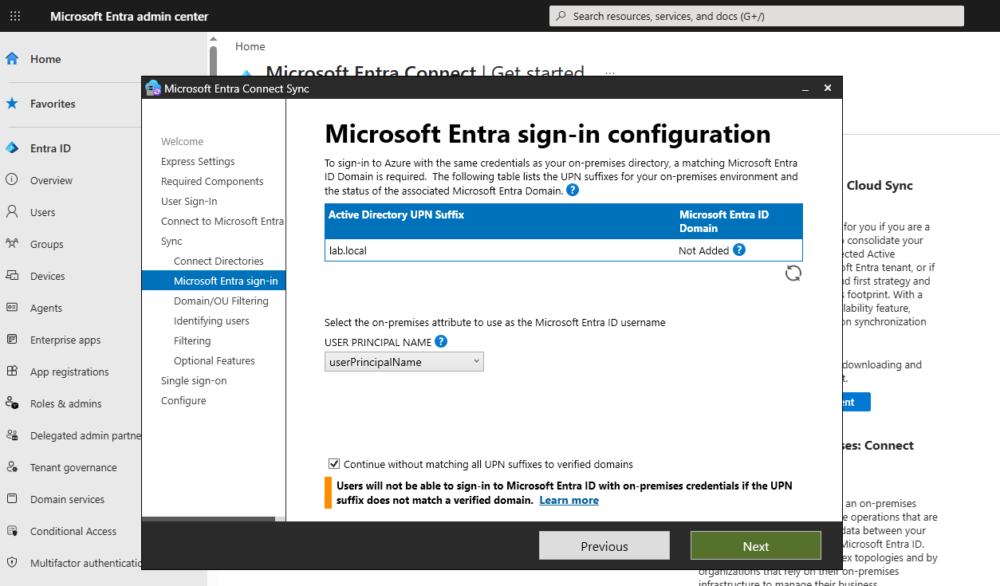
  

<h3>7. Domain and OU filtering — scoped to the Lab OU:</h3>
Only needed the lab OU as I designed it to have everything needed for users and OU in this folder.
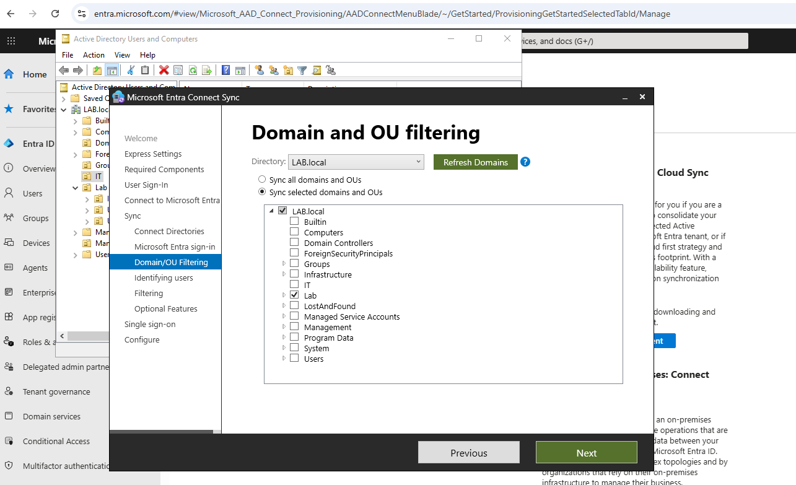
  

<h3>8. Uniquely identifying users:</h3>
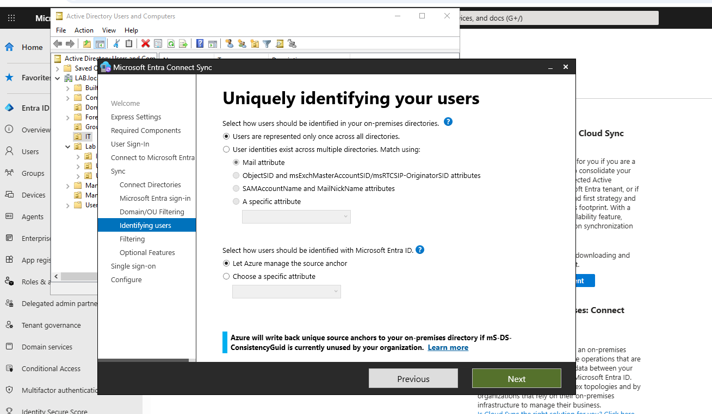
  

<h3>9. Filtering users and devices:</h3>
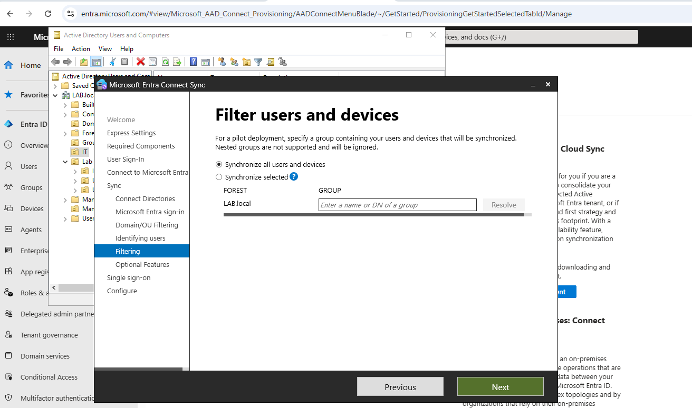
  

<h3>10. Optional features:</h3>
Will add password writeback but for now I dont think it is nessasary
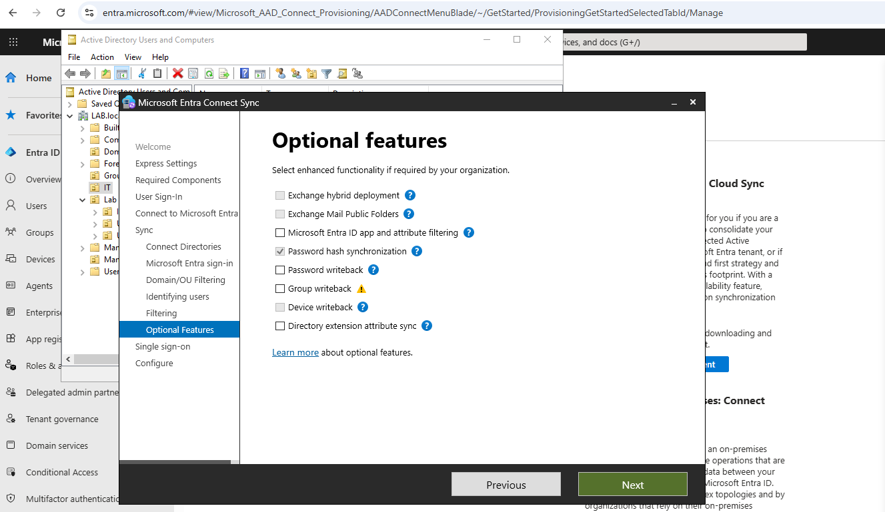
  

<h3>11. Configuration complete:</h3>
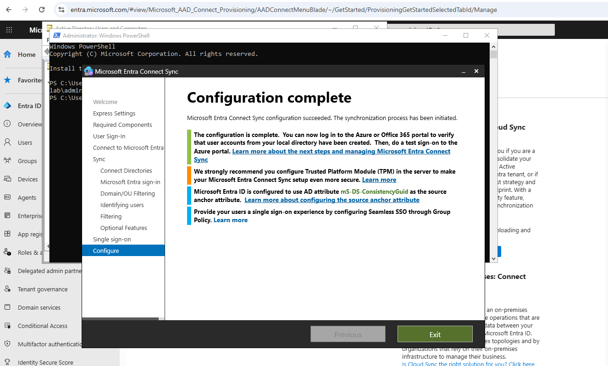
  

<h3>12. All users successfully synchronised:</h3>
You can see there are users on and off premeises so entra connect sync was successful but needed adjustments in AD and changes to dynamic groups to work.
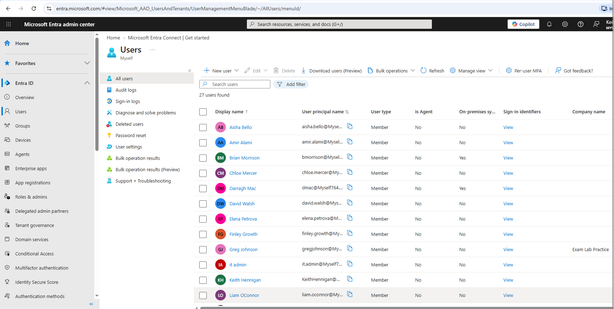
  

<h3>13. AD users in their OU, now matched in Entra ID:</h3>
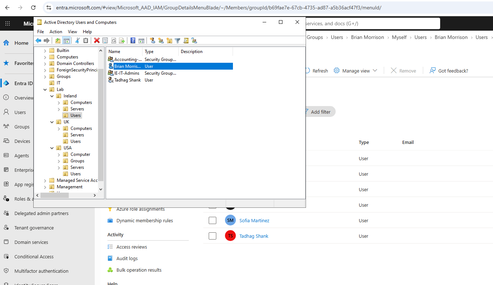

  

<h3>14. Synced Ireland user confirmed in Entra ID:</h3>
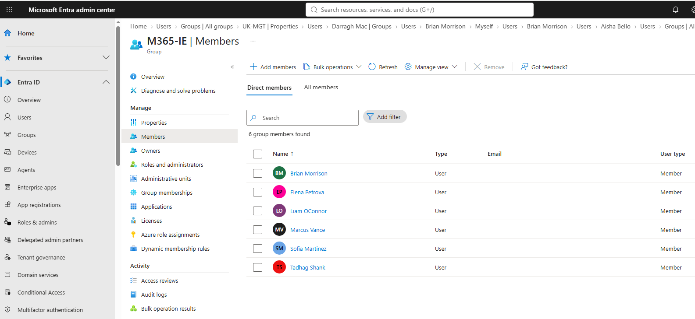

<h2>Troubleshooting and Lessons Learned</h2>

**Issue: couldn't use my Domain Admin account for the sync**
When I tried to connect using my Domain Admin account, Entra Connect blocked it — turns out you're not allowed use an Enterprise or Domain Admin account for the sync connection anymore. Instead I let the wizard create its own dedicated sync account (`MSOL_...`), which only has the permissions it actually needs instead of full admin rights.

**Issue: my lab domain isn't a real verified domain**
My AD domain is `lab.local`, which isn't a real internet domain, so Entra couldn't verify it against my tenant. I had to tick "continue without matching all UPN suffixes" to get past it. Because of this, synced users end up with a `@Myself764.onmicrosoft.com` login instead of their real domain — in an actual company you'd fix this by adding and verifying your real domain in Entra first.

**Issue: Country field didn't match between AD and Entra**
I'd already set Country on my cloud users using short codes (IE, UK, USA) through PowerShell. When I later added Country and Department to my on-prem AD users and synced them over, I noticed AD syncs the full country name instead — so "Ireland" instead of "IE". This meant my dynamic group rules (built around the short codes) weren't picking up the AD users even though everything looked set up right.

**Fix:** switched everything over to full country names (Ireland, United Kingdom, United States) on both sides, and updated the dynamic group rules to match. Good reminder that this kind of thing doesn't throw an error — it just quietly doesn't add the user to the group, which is honestly harder to catch than something that actually fails loudly.

**Main difference between AD and Entra ID I picked up on:**
- In AD, you set Country/Department through ADUC (Address and Organization tabs) or with `Set-ADUser`.
- In Entra ID, it's a different set of tools entirely — the admin center or `Update-MgUser` through Graph PowerShell. Makes sense once you think about it, since AD and Entra are actually two separate directories being kept in sync, not the same thing shown two ways.
- Syncing only goes one direction by default — AD to Entra ID. If you change something directly in Entra (like editing a synced user's Department in the cloud), it doesn't flow back to AD, and can actually get overwritten again next time it syncs. The one exception is password writeback, which I didn't turn on for this lab, but that's the feature that lets a cloud password reset flow back down to AD.
